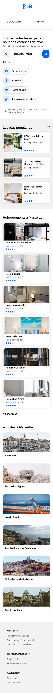

# Booki

Projet n°2 du [parcours Développeur Web](https://openclassrooms.com/fr/paths/556-developpeur-web#path-tabs) d'OpenClassrooms : _Transformez une maquette en site web avec HTML & CSS_.

> Il s'agit d'intégrer les maquettes desktop et mobile qui sont fournies. Des spécifications techniques et fonctionnelles sont également fournies.

## 📚 Technologie utilisées

- HTML
- CSS
- Icônes FontAwesome

## 📎 Rendu visuel

## 💻 Démo du site

[Booki](https://clementstorne.github.io/Booki/)
